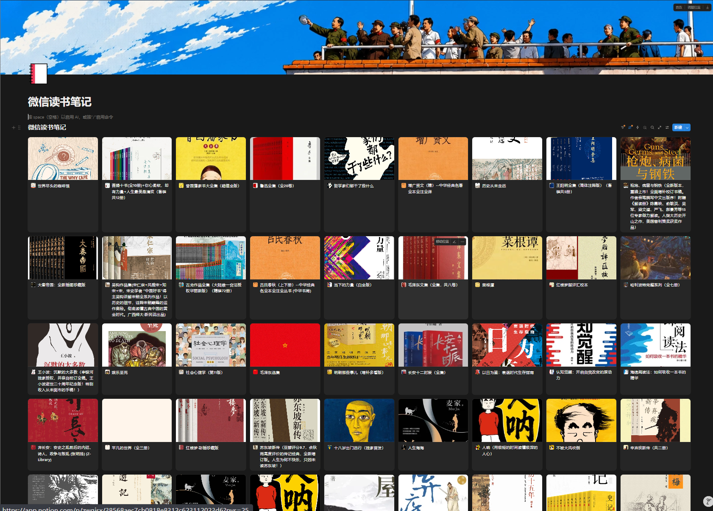

# WeRead Notion Sync

把微信读书自动同步到 Notion，生成一个会自己更新的个人阅读书架。

无需服务器，无需手动导出，也不用自己搭数据库字段。配置一次 GitHub Actions 之后，你只需要继续在微信读书里正常阅读、划线、写想法，项目会定时把书籍、封面、阅读进度、分类、划线和想法同步到 Notion。

> 微信读书适合阅读，Notion 适合沉淀。这个项目把两者连接起来。

## 适合谁

- 想把微信读书笔记长期沉淀到 Notion 的人
- 想拥有一个自动更新的个人阅读数据库的人
- 不想手动复制划线、整理书籍封面和阅读进度的人
- 喜欢用 Notion 做知识管理、阅读记录、复盘系统的人
- 想用 GitHub Actions 做轻量自动化，但不想自己部署服务器的人

## 功能亮点

- 自动同步微信读书书籍
- 自动写入书籍封面、作者、分类、ISBN、评分
- 自动同步阅读状态和阅读进度
- 自动同步划线、想法和书评
- 自动按章节整理笔记内容
- 自动创建 Notion 数据库，不需要手动配置复杂字段
- 支持 GitHub Actions 每天定时同步
- 支持手动一键同步
- 不需要自己购买服务器

## 效果预览

同步后，你会得到一个 Notion Gallery 书架视图：

- 每本书是一张卡片
- 卡片展示书籍封面
- 可以查看阅读状态、阅读进度和分类
- 点进书籍页面后，可以看到章节、划线和想法

建议在仓库里放一张 Notion 书架截图，例如：

```text
assets/preview.png
```

然后在这里展示：

```markdown

```

## 工作原理

项目通过微信读书 Gateway API 读取你的阅读数据，再通过 Notion API 写入你的 Notion 数据库。

```text
微信读书 API Key
        ↓
GitHub Actions 定时运行
        ↓
读取书架、进度、划线、想法
        ↓
写入 Notion 数据库
        ↓
生成个人阅读书架
```

## 准备 3 个值

| 名称 | 用途 | 是否必填 |
| --- | --- | --- |
| `WEREAD_API_KEY` | 微信读书 Gateway API Key，用于读取微信读书数据 | 必填 |
| `NOTION_TOKEN` | Notion Integration Token，用于写入 Notion | 必填 |
| `NOTION_PAGE` | Notion 页面链接、数据库链接或数据库 ID | 必填 |

这些值都应该填写到 GitHub Secrets，不要写进公开代码。

## 快速开始

### 1. Fork 或上传本项目

把本项目放到你自己的 GitHub 仓库里。

### 2. 创建 Notion Integration

打开 Notion Integration 页面：

https://www.notion.so/profile/integrations

创建一个新的 Integration，复制它的 Internal Integration Secret，这个值就是：

```text
NOTION_TOKEN
```

### 3. 新建 Notion 空白页面

在 Notion 里新建一个空白页面，名字可以叫：

```text
微信读书笔记
```

把刚才创建的 Integration 添加到这个页面的 Connections 里。

然后复制这个空白页面链接，先作为：

```text
NOTION_PAGE
```

### 4. 填写 GitHub Secrets

进入你的 GitHub 仓库：

```text
Settings -> Secrets and variables -> Actions -> New repository secret
```

先添加：

```text
NOTION_TOKEN
NOTION_PAGE
```

### 5. 自动创建 Notion 数据库

进入：

```text
Actions -> weread notion sync -> Run workflow
```

第一次运行请选择：

```text
command = setup
full-sync = false
```

setup 成功后，日志里会输出：

```text
DATABASE_ID=...
DATA_SOURCE_ID=...
URL=...
```

复制 `URL` 或 `DATABASE_ID`，回到 GitHub Secrets，把 `NOTION_PAGE` 更新为这个新的数据库链接或 ID。

### 6. 获取微信读书 API Key

打开微信读书 Skills 页面：

https://weread.qq.com/r/weread-skills

登录微信读书账号，创建并复制 Key，这个值就是：

```text
WEREAD_API_KEY
```

然后把它添加到 GitHub Secrets。

### 7. 开始同步

再次进入 GitHub Actions，运行：

```text
command = sync
full-sync = false
```

成功后，回到 Notion 页面，就能看到自动生成的微信读书书架。

默认每天北京时间 08:00 自动同步一次。

## Notion 数据库字段

setup 会自动创建这些字段：

| 字段名 | 类型 | 说明 |
| --- | --- | --- |
| `书名` | Title | 书籍页面标题 |
| `BookId` | Rich text | 微信读书书籍 ID，用于去重 |
| `Sort` | Number | 微信读书同步游标，用于增量同步 |
| `作者` | Rich text | 作者 |
| `封面` | URL | 书籍封面 |
| `状态` | Select | 在读、读完、未读 |
| `阅读进度` | Number / Percent | 阅读百分比 |
| `阅读时长` | Rich text | 阅读时长 |
| `分类` | Multi-select | 微信读书分类 |
| `ISBN` | Rich text | ISBN |
| `评分` | Number | 微信读书评分 |
| `微信读书链接` | URL | 跳转到微信读书网页版 |
| `最后同步时间` | Date | 最近同步时间 |
| `划线数量` | Number | 本书划线数量 |
| `想法数量` | Number | 本书想法数量 |

建议在 Notion 里把数据库切换成 Gallery 视图，并设置：

- Card preview：Page cover 或 封面
- Card size：Medium
- Sort：按 `Sort` 降序
- Properties：显示 `状态`、`阅读进度`、`分类`

## 同步策略

脚本会读取 Notion 数据库中最大的 `Sort`，只同步微信读书里更新过的书。

如果一本书已经存在，脚本会更新它的数据库属性，并替换由同步脚本管理的内容区。为了尽量保留你的个人笔记，页面中会使用同步标记：

```text
--- weread-notion-sync:begin ---
--- weread-notion-sync:end ---
```

请不要在这两个标记之间写长期笔记。你可以在标记外自由补充自己的读书笔记。

## 手动同步和自动同步

自动同步：

```text
每天北京时间 08:00
```

手动同步：

```text
Actions -> weread notion sync -> Run workflow
command = sync
```

如果你刚刚在微信读书里划线，想立刻看到结果，可以手动运行一次。

## 本地运行

```bash
python -m pip install -e .
cp .env.example .env
weread-notion sync
```

Windows PowerShell：

```powershell
$env:WEREAD_API_KEY="你的微信读书 API Key"
$env:NOTION_TOKEN="你的 Notion Token"
$env:NOTION_PAGE="你的 Notion 数据库链接"
weread-notion sync
```

## 安全说明

`WEREAD_API_KEY` 可以读取你的微信读书数据，`NOTION_TOKEN` 可以写入你的 Notion 页面。

请务必：

- 使用 GitHub Secrets 保存敏感信息
- 不要把 Key 写进代码
- 不要截图公开 Token 或 API Key
- 不要把自己的 Key 发给别人

## 常见问题

### 为什么第一次同步比较慢？

第一次同步需要读取书架、书籍详情、章节、划线、想法，并逐条写入 Notion。Notion API 也有速度限制，所以第一次通常会更慢。

### 为什么 Notion 里一开始是表格？

Notion 默认可能显示 Table 视图。你可以在数据库右上角的视图设置里，把 Layout 改成 Gallery。

### 我可以改 Notion 页面样式吗？

可以。你可以调整视图、排序、筛选、卡片大小和显示属性。不要删除或重命名 `BookId` 和 `Sort`，它们是同步必需字段。

### 我可以在书籍页面里写自己的笔记吗？

可以，但建议写在同步标记之外。同步标记之间的内容会被脚本更新。

## Roadmap

- 更漂亮的 Notion 模板
- 更细致的同步日志
- 阅读统计和年度报告
- 按分类生成阅读分析
- 支持更多自定义字段
- 更友好的错误提示

## Star

如果这个项目帮你把微信读书笔记带进了 Notion，欢迎点一个 Star。

也欢迎提交 Issue 或 PR，一起把它变成更好用的个人阅读自动化工具。
